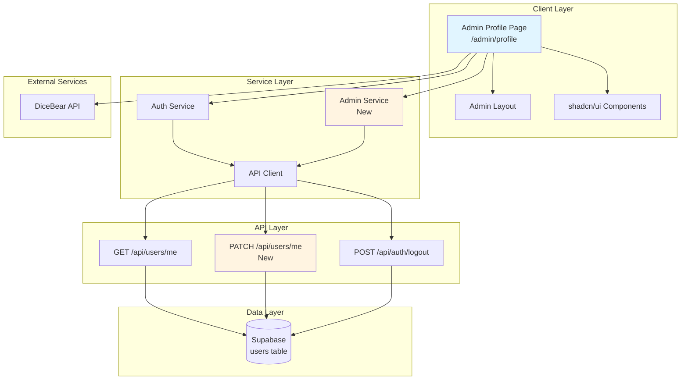
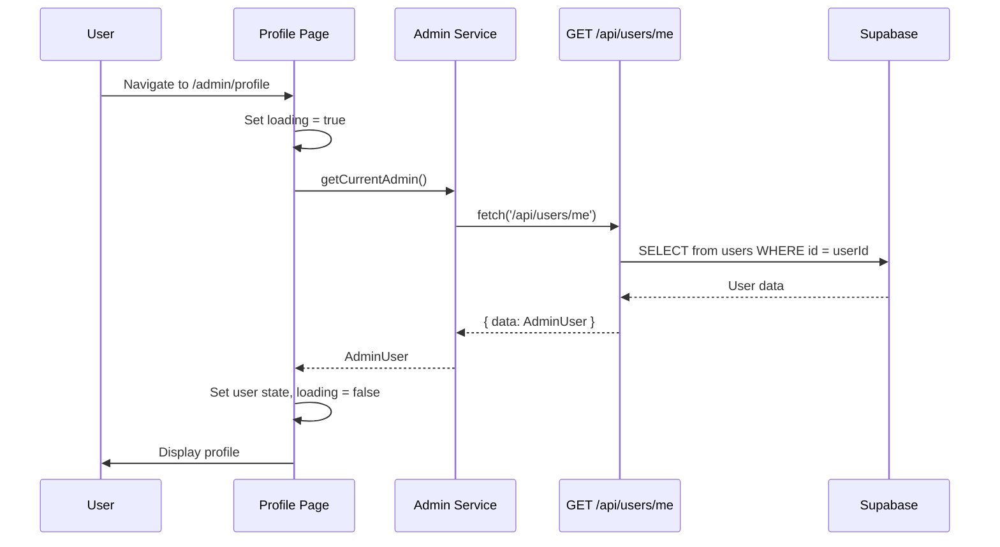
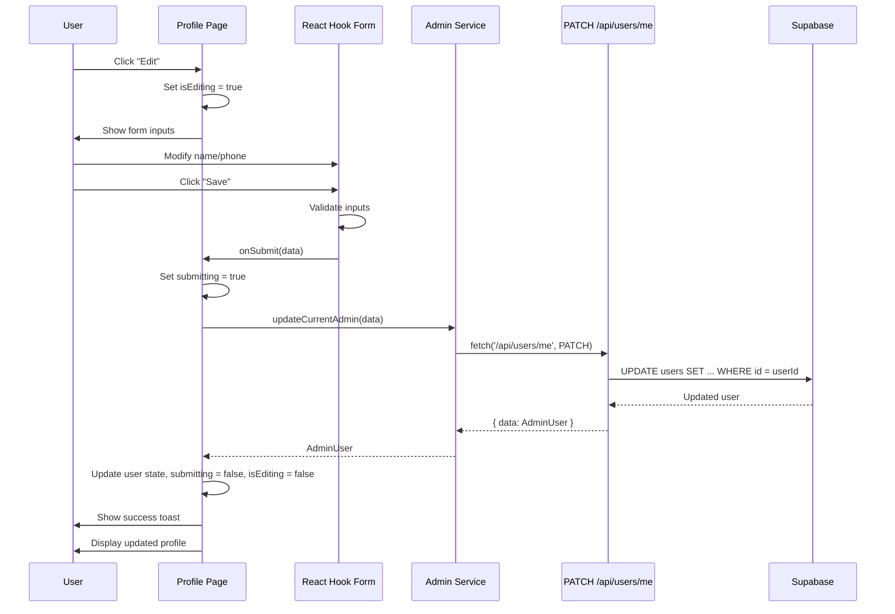
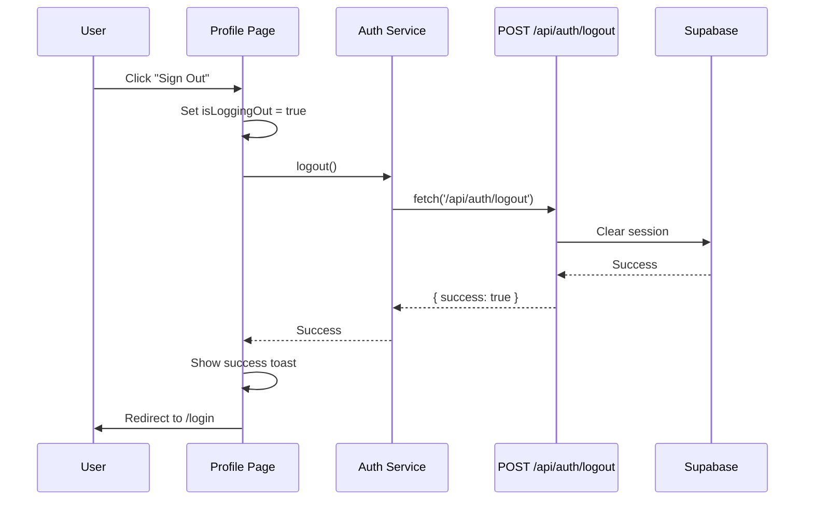

# Design Document: Admin Profile Page

## Overview

The Admin Profile Page is a dedicated interface for administrators to view and manage their personal profile information. This feature provides a secure, user-friendly page at `/admin/profile` that displays admin account details, allows profile editing, and provides session management capabilities.

### Key Features

- **Profile Display**: View admin user information including name, email, role, and account metadata
- **Avatar Integration**: Visual representation using DiceBear API for consistent user identification
- **Profile Editing**: Update modifiable fields (name, phone) with validation
- **Session Management**: Secure logout functionality
- **Responsive Design**: Mobile-first approach using shadcn/ui components
- **Loading States**: Comprehensive feedback for asynchronous operations

### Design Goals

1. **Consistency**: Mirror the existing agent profile page design patterns while adapting for admin-specific needs
2. **Security**: Enforce role-based access control and protect sensitive operations
3. **Usability**: Provide clear feedback and intuitive editing workflows
4. **Maintainability**: Leverage existing services and components to minimize code duplication

## Architecture

### High-Level Architecture



### Component Hierarchy

```
AdminProfilePage (page.tsx)
├── Avatar Component (inline)
│   └── DiceBear API Integration
├── Profile Information Card
│   ├── Display Mode (default)
│   │   ├── Name Display
│   │   ├── Email Display
│   │   ├── Phone Display
│   │   ├── Role Badge
│   │   └── Created Date
│   └── Edit Mode (toggled)
│       ├── React Hook Form
│       ├── Name Input (editable)
│       ├── Phone Input (editable)
│       ├── Email Display (read-only)
│       ├── Role Display (read-only)
│       ├── Save Button
│       └── Cancel Button
├── System Information Card
│   ├── User ID Display
│   └── Account Status
└── Account Actions Card
    └── Logout Button
```

## Components and Interfaces

### 1. Admin Profile Page Component

**Location**: `app/admin/profile/page.tsx`

**Purpose**: Main page component that orchestrates profile display, editing, and session management.

**Key Responsibilities**:
- Fetch and display current admin user data
- Manage edit mode state
- Handle form submission for profile updates
- Coordinate logout operations
- Render loading and error states

**State Management**:
```typescript
interface AdminProfilePageState {
  user: AdminUser | null
  loading: boolean
  isEditing: boolean
  submitting: boolean
  isLoggingOut: boolean
}
```

**Props**: None (page component)

### 2. Admin Service

**Location**: `services/admin.service.ts` (new file)

**Purpose**: Encapsulate admin-specific API operations.

**Functions**:
```typescript
// Get current admin user profile
export async function getCurrentAdmin(): Promise<AdminUser>

// Update current admin user profile
export async function updateCurrentAdmin(updates: AdminProfileUpdate): Promise<AdminUser>
```

### 3. API Route: PATCH /api/users/me

**Location**: `app/api/users/me/route.ts` (extend existing)

**Purpose**: Handle profile update requests for the authenticated user.

**Request Body**:
```typescript
{
  name?: string
  phone?: string
}
```

**Response**:
```typescript
{
  data: {
    id: string
    email: string
    role: string
    status: string
    name?: string
    phone?: string
    created_at: string
    updated_at: string
  }
}
```

**Validation**:
- Name: minimum 2 characters if provided
- Phone: valid phone format if provided
- Email and role cannot be modified

## Data Models

### AdminUser Interface

```typescript
interface AdminUser {
  id: string
  email: string
  role: 'admin' | 'manager' | 'agent'
  status: 'pending' | 'active' | 'rejected' | 'suspended'
  name?: string
  phone?: string
  created_at: string
  updated_at: string
}
```

### AdminProfileUpdate Interface

```typescript
interface AdminProfileUpdate {
  name?: string
  phone?: string
}
```

### Form Schema

```typescript
const profileSchema = z.object({
  name: z.string().min(2, 'Name must be at least 2 characters'),
  phone: z.string().optional().or(z.literal('')),
})

type ProfileFormData = z.infer<typeof profileSchema>
```

## Data Flow

### Profile Load Flow



### Profile Update Flow



### Logout Flow



## Correctness Properties

No properties defined.

Property-based testing (PBT) is not appropriate for this feature because:

1. **UI-centric functionality**: The admin profile page is primarily concerned with rendering UI components, managing form state, and handling user interactions. These are best tested with snapshot tests, visual regression tests, and example-based integration tests.

2. **Simple CRUD operations**: Profile updates are straightforward database writes with no complex transformation logic. There are no universal properties that would benefit from testing across 100+ generated inputs.

3. **Form validation**: While validation rules exist (name length, phone format), these are simple constraints best verified with example-based unit tests covering specific valid/invalid cases rather than property-based generation.

4. **Navigation and authentication**: Requirements involve routing, authentication checks, and session management—these are integration concerns, not pure functions with testable properties.

5. **External dependencies**: The DiceBear API integration is an external service call with no internal logic to test via properties.

**Alternative Testing Strategy**: This feature uses unit tests for form validation logic and service functions, integration tests for API interactions and authentication flows, component tests for React component behavior, and end-to-end tests for complete user workflows.

## Error Handling

### Error Categories and Responses

| Error Type | Scenario | User Feedback | Recovery Action |
|------------|----------|---------------|-----------------|
| **Authentication Error** | User not authenticated | Redirect to login | User must log in |
| **Authorization Error** | Non-admin accessing page | Show error message or redirect | Redirect to appropriate dashboard |
| **Network Error** | API request fails | Toast: "Network error. Please try again." | Retry button |
| **Validation Error** | Invalid form input | Inline form error messages | User corrects input |
| **Server Error** | Backend processing fails | Toast: "Failed to update profile. Please try again." | Retry or contact support |
| **Avatar Load Error** | DiceBear API fails | Show fallback icon | Graceful degradation |

### Error Handling Implementation

```typescript
// Profile fetch error
try {
  const userData = await adminService.getCurrentAdmin()
  setUser(userData)
} catch (error) {
  toast({
    title: 'Error',
    description: 'Failed to load profile',
    variant: 'destructive',
  })
  // Show error state with retry option
}

// Profile update error
try {
  const updated = await adminService.updateCurrentAdmin(data)
  setUser(updated)
  setIsEditing(false)
  toast({
    title: 'Success',
    description: 'Profile updated successfully',
  })
} catch (error) {
  toast({
    title: 'Error',
    description: error instanceof Error ? error.message : 'Failed to update profile',
    variant: 'destructive',
  })
  // Keep form in edit mode with user's values
}

// Logout error
try {
  await authService.logout()
  router.push('/login')
} catch (error) {
  toast({
    title: 'Error',
    description: 'Failed to logout',
    variant: 'destructive',
  })
}
```

## Testing Strategy

### Unit Tests

**Focus**: Individual functions and components in isolation

**Test Cases**:

1. **Admin Service Tests** (`services/admin.service.test.ts`)
   - `getCurrentAdmin()` returns admin user data on success
   - `getCurrentAdmin()` throws error on API failure
   - `updateCurrentAdmin()` sends correct payload
   - `updateCurrentAdmin()` returns updated user data
   - `updateCurrentAdmin()` throws error on validation failure

2. **Form Validation Tests**
   - Name field requires minimum 2 characters
   - Phone field accepts valid phone formats
   - Phone field accepts empty string
   - Form submission disabled when validation fails

3. **Component Unit Tests** (`app/admin/profile/page.test.tsx`)
   - Renders loading state initially
   - Displays user data after successful fetch
   - Shows error message when fetch fails
   - Edit button toggles edit mode
   - Cancel button restores original values
   - Save button disabled during submission
   - Logout button disabled during logout

### Integration Tests

**Focus**: Component interactions with services and API

**Test Cases**:

1. **Profile Load Integration**
   - Page fetches user data on mount
   - Displays all user fields correctly
   - Shows fallback for missing optional fields

2. **Profile Update Integration**
   - Form submission calls update API
   - Success updates displayed data
   - Failure preserves form state
   - Toast notifications appear correctly

3. **Logout Integration**
   - Logout button calls auth service
   - Success redirects to login page
   - Failure shows error toast

### End-to-End Tests

**Focus**: Complete user workflows

**Test Scenarios**:

1. **Happy Path: View and Edit Profile**
   - Admin logs in
   - Navigates to /admin/profile
   - Views profile information
   - Clicks Edit
   - Updates name and phone
   - Clicks Save
   - Sees success message
   - Verifies updated data displayed

2. **Error Path: Validation Failure**
   - Admin enters invalid name (1 character)
   - Attempts to save
   - Sees validation error
   - Corrects input
   - Successfully saves

3. **Logout Flow**
   - Admin clicks Sign Out
   - Sees loading indicator
   - Redirected to login page
   - Cannot access /admin/profile without re-authenticating

### Manual Testing Checklist

- [ ] Avatar displays correctly with admin user ID as seed
- [ ] Avatar fallback works when DiceBear API fails
- [ ] All profile fields display correctly
- [ ] Empty optional fields show "—" or "Not set"
- [ ] Edit mode enables correct fields
- [ ] Email and role remain read-only in edit mode
- [ ] Form validation works for all fields
- [ ] Save button shows loading state
- [ ] Cancel button restores original values
- [ ] Success toast appears after save
- [ ] Error toast appears on save failure
- [ ] Logout button shows loading state
- [ ] Logout redirects to login page
- [ ] Page is responsive on mobile, tablet, desktop
- [ ] Keyboard navigation works for all interactive elements
- [ ] Screen reader announces form labels correctly
- [ ] Color contrast meets accessibility standards

## Implementation Notes

### Technology Stack

- **Framework**: Next.js 16 (App Router)
- **Language**: TypeScript 5.7
- **UI Library**: React 19
- **Component Library**: shadcn/ui (Radix UI primitives)
- **Form Management**: React Hook Form with Zod validation
- **Styling**: Tailwind CSS 4.2
- **Backend**: Supabase (PostgreSQL)
- **Authentication**: Supabase Auth with custom middleware

### Key Dependencies

```json
{
  "react-hook-form": "^7.54.1",
  "@hookform/resolvers": "^3.9.1",
  "zod": "^3.24.1",
  "lucide-react": "^0.564.0",
  "@supabase/supabase-js": "^2.49.1"
}
```

### File Structure

```
app/
├── admin/
│   ├── profile/
│   │   └── page.tsx          # New: Admin profile page
│   └── layout.tsx             # Existing: Admin layout wrapper
├── api/
│   ├── users/
│   │   └── me/
│   │       └── route.ts       # Modified: Add PATCH handler
│   └── auth/
│       └── logout/
│           └── route.ts       # Existing: Logout endpoint
services/
├── admin.service.ts           # New: Admin-specific operations
├── auth.service.ts            # Existing: Authentication operations
└── api-client.ts              # Existing: HTTP client utilities
```

### Design Patterns

1. **Service Layer Pattern**: Encapsulate API calls in service modules
2. **Controlled Components**: Use React Hook Form for form state management
3. **Optimistic UI**: Show loading states immediately on user actions
4. **Error Boundaries**: Graceful error handling with user feedback
5. **Separation of Concerns**: Separate data fetching, state management, and presentation

### Security Considerations

1. **Authentication**: Verify user is authenticated before rendering page
2. **Authorization**: Verify user has admin role
3. **Input Validation**: Validate all user inputs on client and server
4. **CSRF Protection**: Use credentials: 'include' for cookie-based auth
5. **XSS Prevention**: React's built-in escaping + proper input sanitization
6. **Session Management**: Secure logout clears all session data

### Performance Considerations

1. **Code Splitting**: Page-level code splitting via Next.js App Router
2. **Lazy Loading**: Avatar image loaded asynchronously
3. **Debouncing**: Not needed for this feature (no search/autocomplete)
4. **Caching**: Leverage Next.js caching for static assets
5. **Bundle Size**: Reuse existing components to minimize new dependencies

### Accessibility Requirements

1. **Semantic HTML**: Use proper heading hierarchy and landmarks
2. **ARIA Labels**: Add labels for icon-only buttons
3. **Keyboard Navigation**: All interactive elements accessible via keyboard
4. **Focus Management**: Proper focus indicators and logical tab order
5. **Screen Reader Support**: Form labels and error messages announced
6. **Color Contrast**: Minimum 4.5:1 for normal text, 3:1 for large text

### Browser Support

- **Modern Browsers**: Chrome, Firefox, Safari, Edge (latest 2 versions)
- **Mobile Browsers**: iOS Safari, Chrome Mobile
- **Minimum Requirements**: ES2020 support, CSS Grid, Flexbox

## Migration and Deployment

### Database Changes

**No database migrations required**. The existing `users` table already supports the necessary fields:
- `id`, `email`, `role`, `status`, `created_at`, `updated_at` (existing)
- Optional fields like `name` and `phone` can be added to the `users` table if not present

**If name/phone fields don't exist in users table**, add migration:

```sql
-- Migration: Add name and phone to users table
ALTER TABLE users
ADD COLUMN IF NOT EXISTS name TEXT,
ADD COLUMN IF NOT EXISTS phone TEXT;
```

### Deployment Steps

1. **Pre-deployment**:
   - Review and merge code changes
   - Run unit and integration tests
   - Verify database schema includes name/phone fields

2. **Deployment**:
   - Deploy backend API changes (PATCH /api/users/me)
   - Deploy frontend changes (admin profile page)
   - Verify environment variables are set

3. **Post-deployment**:
   - Smoke test: Admin can access /admin/profile
   - Verify profile data loads correctly
   - Test profile update functionality
   - Test logout functionality
   - Monitor error logs for issues

4. **Rollback Plan**:
   - Revert to previous deployment if critical issues found
   - Database changes are additive (no data loss on rollback)

### Feature Flags

Not required for this feature. The page is protected by role-based access control and will only be accessible to admin users.

## Future Enhancements

### Phase 2 Potential Features

1. **Password Change**: Allow admins to change their password from profile page
2. **Two-Factor Authentication**: Enable 2FA setup and management
3. **Profile Picture Upload**: Replace DiceBear with custom image upload
4. **Activity Log**: Show recent admin actions and login history
5. **Notification Preferences**: Configure email and in-app notifications
6. **Theme Preferences**: Allow user to set light/dark mode preference
7. **API Key Management**: Generate and manage API keys for integrations

### Scalability Considerations

- **Caching**: Implement Redis caching for user profile data
- **CDN**: Serve avatar images through CDN
- **Rate Limiting**: Add rate limits to profile update endpoint
- **Audit Logging**: Log all profile changes to audit_logs table

## Appendix

### Reference Implementation

The agent profile page (`app/agent/profile/page.tsx`) serves as the primary reference for:
- Component structure and layout
- Form handling patterns
- Loading and error states
- Toast notification usage
- Responsive design approach

### API Response Examples

**GET /api/users/me - Success**:
```json
{
  "data": {
    "id": "123e4567-e89b-12d3-a456-426614174000",
    "email": "admin@example.com",
    "role": "admin",
    "status": "active",
    "name": "John Admin",
    "phone": "+1234567890",
    "created_at": "2024-01-15T10:30:00Z",
    "updated_at": "2024-01-20T14:45:00Z"
  }
}
```

**PATCH /api/users/me - Success**:
```json
{
  "data": {
    "id": "123e4567-e89b-12d3-a456-426614174000",
    "email": "admin@example.com",
    "role": "admin",
    "status": "active",
    "name": "John Administrator",
    "phone": "+1234567890",
    "created_at": "2024-01-15T10:30:00Z",
    "updated_at": "2024-01-20T15:00:00Z"
  }
}
```

**Error Response**:
```json
{
  "error": "Validation failed",
  "message": "Name must be at least 2 characters",
  "status": 400
}
```

### DiceBear API Integration

**URL Format**: `https://api.dicebear.com/7.x/avataaars/svg?seed={userId}`

**Example**: `https://api.dicebear.com/7.x/avataaars/svg?seed=123e4567-e89b-12d3-a456-426614174000`

**Fallback**: If DiceBear API fails, display a `<User>` icon from lucide-react

**Implementation**:
```tsx
 {
    e.currentTarget.style.display = 'none'
    // Show fallback icon
  }}
/>
```
