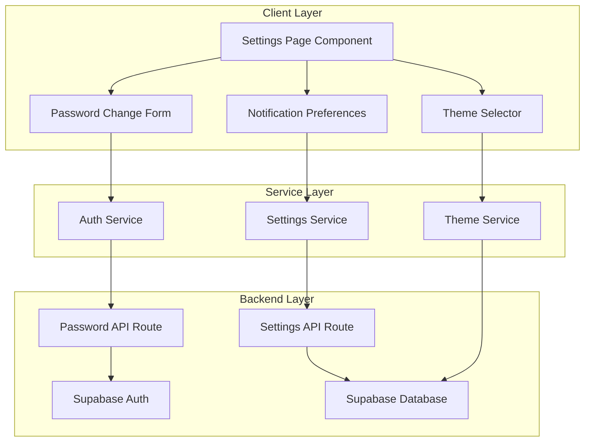

# Design Document: Admin Settings Page (MVP)

## Overview

The Admin Settings Page is a comprehensive configuration interface accessible at `/admin/settings` that allows administrators to manage their account settings, security preferences, and application behavior. This MVP implementation focuses on three essential features:

1. **Password Change** - Secure password update functionality
2. **Theme Selector** - Light/dark/system theme preferences
3. **Notification Preferences** - Email, push, and in-app notification controls

The design follows the existing application patterns established in the admin profile page, using Next.js 16 App Router, React 19, Supabase for backend services, and shadcn/ui components with Radix UI primitives.

### Design Principles

- **Progressive Enhancement**: MVP features are fully functional while maintaining extensibility for future additions (2FA, session management, data export, integrations)
- **Consistency**: Match existing UI patterns from the admin profile page
- **Security First**: Password changes require current password verification
- **Immediate Feedback**: Real-time validation and instant theme application
- **Responsive Design**: Mobile-first approach with desktop optimization

### Future Extensibility

The architecture is designed to accommodate future features without major refactoring:
- Two-factor authentication (2FA)
- Session management and device tracking
- Data export and backup services
- Third-party integrations
- Advanced security settings

## Architecture

### High-Level Architecture



### Component Hierarchy

```
SettingsPage (page.tsx)
├── SettingsHeader
├── SettingsTabs
│   ├── SecurityTab
│   │   └── PasswordChangeForm
│   ├── AppearanceTab
│   │   └── ThemeSelector
│   └── NotificationsTab
│       └── NotificationPreferences
└── SettingsFooter
```

### Data Flow

1. **Page Load**: Fetch current user settings from Supabase
2. **User Interaction**: Form changes trigger local state updates
3. **Validation**: Client-side validation with Zod schemas
4. **Submission**: API route handles server-side validation and persistence
5. **Feedback**: Toast notifications confirm success/failure
6. **State Sync**: UI updates reflect persisted changes

## Components and Interfaces

### 1. Settings Page Component

**File**: `app/admin/settings/page.tsx`

**Responsibilities**:
- Route protection (admin-only access)
- Tab navigation management
- Settings data fetching and state management
- Loading and error states

**Key Features**:
- Client component with `'use client'` directive
- Uses `useEffect` for initial data fetch
- Implements tab-based navigation with Radix UI Tabs
- Responsive layout matching profile page patterns

**State Management**:
```typescript
interface SettingsPageState {
  loading: boolean
  activeTab: 'security' | 'appearance' | 'notifications'
  user: AdminUser | null
  settings: UserSettings | null
}
```

### 2. Password Change Form Component

**File**: `components/admin/settings/password-change-form.tsx`

**Responsibilities**:
- Secure password update interface
- Current password verification
- New password validation
- Confirmation matching

**Form Schema**:
```typescript
const passwordChangeSchema = z.object({
  currentPassword: z.string().min(1, 'Current password is required'),
  newPassword: z.string()
    .min(8, 'Password must be at least 8 characters')
    .regex(/[A-Z]/, 'Password must contain at least one uppercase letter')
    .regex(/[a-z]/, 'Password must contain at least one lowercase letter')
    .regex(/[0-9]/, 'Password must contain at least one number'),
  confirmPassword: z.string()
}).refine((data) => data.newPassword === data.confirmPassword, {
  message: "Passwords don't match",
  path: ["confirmPassword"],
})
```

**UI Elements**:
- Current password input (password type)
- New password input with strength indicator
- Confirm password input
- Submit button with loading state
- Validation error messages

### 3. Theme Selector Component

**File**: `components/admin/settings/theme-selector.tsx`

**Responsibilities**:
- Theme selection interface (light/dark/system)
- Immediate theme application
- Theme preference persistence

**Implementation**:
- Uses `next-themes` package (already in dependencies)
- Radio group for theme selection
- Visual preview of each theme option
- Persists to localStorage and database

**Theme Options**:
```typescript
type Theme = 'light' | 'dark' | 'system'

interface ThemeOption {
  value: Theme
  label: string
  description: string
  icon: LucideIcon
}
```

### 4. Notification Preferences Component

**File**: `components/admin/settings/notification-preferences.tsx`

**Responsibilities**:
- Notification channel toggles
- Notification type preferences
- Immediate preference updates

**Notification Types**:
```typescript
interface NotificationPreferences {
  email: {
    salesAlerts: boolean
    inventoryAlerts: boolean
    userApprovals: boolean
    systemUpdates: boolean
  }
  push: {
    salesAlerts: boolean
    inventoryAlerts: boolean
    userApprovals: boolean
  }
  inApp: {
    salesAlerts: boolean
    inventoryAlerts: boolean
    userApprovals: boolean
    systemUpdates: boolean
  }
}
```

**UI Elements**:
- Section headers for each channel (Email, Push, In-App)
- Switch components for each notification type
- Descriptive labels and helper text
- Save button with auto-save option

## Data Models

### User Settings Table

**Table**: `user_settings`

```sql
CREATE TABLE user_settings (
  id UUID PRIMARY KEY DEFAULT gen_random_uuid(),
  user_id UUID NOT NULL REFERENCES users(id) ON DELETE CASCADE,
  theme VARCHAR(10) DEFAULT 'system' CHECK (theme IN ('light', 'dark', 'system')),
  notification_preferences JSONB DEFAULT '{
    "email": {
      "salesAlerts": true,
      "inventoryAlerts": true,
      "userApprovals": true,
      "systemUpdates": true
    },
    "push": {
      "salesAlerts": true,
      "inventoryAlerts": true,
      "userApprovals": true
    },
    "inApp": {
      "salesAlerts": true,
      "inventoryAlerts": true,
      "userApprovals": true,
      "systemUpdates": true
    }
  }'::jsonb,
  created_at TIMESTAMPTZ DEFAULT NOW(),
  updated_at TIMESTAMPTZ DEFAULT NOW(),
  UNIQUE(user_id)
);

-- Index for fast user lookups
CREATE INDEX idx_user_settings_user_id ON user_settings(user_id);

-- Trigger to update updated_at
CREATE TRIGGER update_user_settings_updated_at
  BEFORE UPDATE ON user_settings
  FOR EACH ROW
  EXECUTE FUNCTION update_updated_at_column();
```

### TypeScript Interfaces

```typescript
// Database types extension
interface UserSettings {
  id: string
  user_id: string
  theme: 'light' | 'dark' | 'system'
  notification_preferences: NotificationPreferences
  created_at: string
  updated_at: string
}

interface NotificationPreferences {
  email: NotificationChannelPreferences
  push: NotificationChannelPreferences
  inApp: NotificationChannelPreferences
}

interface NotificationChannelPreferences {
  salesAlerts: boolean
  inventoryAlerts: boolean
  userApprovals: boolean
  systemUpdates?: boolean // Optional for push notifications
}

// API request/response types
interface UpdatePasswordRequest {
  currentPassword: string
  newPassword: string
}

interface UpdatePasswordResponse {
  success: boolean
  message: string
}

interface UpdateSettingsRequest {
  theme?: 'light' | 'dark' | 'system'
  notification_preferences?: Partial<NotificationPreferences>
}

interface UpdateSettingsResponse {
  success: boolean
  settings: UserSettings
}
```

## API Routes

### 1. Password Change Endpoint

**Route**: `app/api/settings/password/route.ts`

**Method**: `POST`

**Request Body**:
```typescript
{
  currentPassword: string
  newPassword: string
}
```

**Response**:
```typescript
{
  success: boolean
  message: string
}
```

**Implementation Flow**:
1. Verify user authentication
2. Validate request body with Zod
3. Verify current password with Supabase Auth
4. Update password using Supabase Auth API
5. Return success/error response

**Error Handling**:
- 401: Unauthorized (not logged in)
- 400: Invalid request body
- 403: Current password incorrect
- 500: Server error

### 2. Settings Update Endpoint

**Route**: `app/api/settings/route.ts`

**Methods**: `GET`, `PATCH`

**GET Response**:
```typescript
{
  success: boolean
  settings: UserSettings
}
```

**PATCH Request Body**:
```typescript
{
  theme?: 'light' | 'dark' | 'system'
  notification_preferences?: Partial<NotificationPreferences>
}
```

**PATCH Response**:
```typescript
{
  success: boolean
  settings: UserSettings
}
```

**Implementation Flow**:
1. Verify user authentication
2. For GET: Fetch settings from database (create default if not exists)
3. For PATCH: Validate request body, update settings, return updated record
4. Handle errors appropriately

## Services

### Settings Service

**File**: `services/settings.service.ts`

**Functions**:

```typescript
// Fetch current user settings
export async function getUserSettings(): Promise<UserSettings>

// Update user settings
export async function updateUserSettings(
  updates: UpdateSettingsRequest
): Promise<UserSettings>

// Update password
export async function updatePassword(
  currentPassword: string,
  newPassword: string
): Promise<void>
```

**Implementation Details**:
- Uses `api-client.ts` for HTTP requests
- Handles error transformation
- Provides type-safe interfaces

### Theme Service

**File**: `lib/theme.ts`

**Functions**:

```typescript
// Get current theme
export function getCurrentTheme(): Theme

// Set theme
export function setTheme(theme: Theme): void

// Subscribe to theme changes
export function subscribeToTheme(callback: (theme: Theme) => void): () => void
```

**Implementation**:
- Wraps `next-themes` functionality
- Syncs with database settings
- Provides React hooks for components

## Error Handling

### Client-Side Error Handling

1. **Form Validation Errors**:
   - Display inline error messages below form fields
   - Disable submit button while errors exist
   - Use Zod error messages for clarity

2. **API Request Errors**:
   - Show toast notifications for failed requests
   - Display specific error messages from server
   - Provide retry mechanisms for transient failures

3. **Loading States**:
   - Show spinners during async operations
   - Disable form inputs during submission
   - Prevent duplicate submissions

### Server-Side Error Handling

1. **Authentication Errors**:
   - Return 401 for unauthenticated requests
   - Redirect to login page on client

2. **Validation Errors**:
   - Return 400 with detailed error messages
   - Use Zod for schema validation

3. **Database Errors**:
   - Log errors for debugging
   - Return generic 500 errors to client
   - Implement retry logic for transient failures

4. **Password Verification Errors**:
   - Return 403 for incorrect current password
   - Rate limit password change attempts
   - Log failed attempts for security monitoring

## Testing Strategy

### Unit Tests

**Password Change Form**:
- Validate password strength requirements
- Verify confirmation matching logic
- Test error message display
- Verify form submission handling

**Theme Selector**:
- Test theme selection updates
- Verify localStorage persistence
- Test system theme detection

**Notification Preferences**:
- Test toggle state management
- Verify preference updates
- Test save functionality

### Integration Tests

**Settings API Routes**:
- Test GET /api/settings returns user settings
- Test PATCH /api/settings updates settings
- Test POST /api/settings/password changes password
- Verify authentication requirements
- Test error responses

**Settings Service**:
- Test getUserSettings fetches from API
- Test updateUserSettings sends correct payload
- Test updatePassword handles errors

### End-to-End Tests

**Settings Page Flow**:
1. Navigate to /admin/settings
2. Verify page loads with current settings
3. Change password successfully
4. Switch theme and verify application
5. Toggle notification preferences and save
6. Verify settings persist after page reload

**Error Scenarios**:
1. Test incorrect current password
2. Test weak new password
3. Test mismatched password confirmation
4. Test network error handling

## Implementation Plan

### Phase 1: Database and API Setup

1. Create `user_settings` table migration
2. Implement GET /api/settings route
3. Implement PATCH /api/settings route
4. Implement POST /api/settings/password route
5. Create settings service functions

### Phase 2: Core Components

1. Create settings page layout
2. Implement tab navigation
3. Create password change form component
4. Create theme selector component
5. Create notification preferences component

### Phase 3: Integration and Polish

1. Connect components to API routes
2. Implement error handling
3. Add loading states
4. Add success/error notifications
5. Test responsive design

### Phase 4: Testing and Documentation

1. Write unit tests for components
2. Write integration tests for API routes
3. Perform end-to-end testing
4. Update user documentation
5. Code review and refinement

## Security Considerations

### Password Security

1. **Current Password Verification**: Always verify current password before allowing changes
2. **Password Strength**: Enforce minimum 8 characters with complexity requirements
3. **Rate Limiting**: Limit password change attempts to prevent brute force
4. **Secure Transmission**: Use HTTPS for all password-related requests
5. **No Password Storage**: Never log or store passwords in plain text

### Authentication

1. **Session Validation**: Verify user session on every API request
2. **CSRF Protection**: Use Next.js built-in CSRF protection
3. **Role-Based Access**: Ensure only admin users can access settings
4. **Token Refresh**: Handle token expiration gracefully

### Data Privacy

1. **User Isolation**: Ensure users can only access their own settings
2. **Audit Logging**: Log security-related changes (password updates)
3. **Secure Defaults**: Use secure default notification preferences
4. **Data Encryption**: Leverage Supabase encryption for sensitive data

## Performance Considerations

### Client-Side Performance

1. **Code Splitting**: Lazy load settings components
2. **Optimistic Updates**: Update UI immediately for theme changes
3. **Debouncing**: Debounce notification preference updates
4. **Memoization**: Use React.memo for expensive components

### Server-Side Performance

1. **Database Indexing**: Index user_id for fast lookups
2. **Connection Pooling**: Use Supabase connection pooling
3. **Caching**: Cache user settings in session
4. **Query Optimization**: Use efficient Supabase queries

### Network Performance

1. **Request Batching**: Batch multiple setting updates
2. **Compression**: Enable gzip compression
3. **CDN**: Serve static assets from CDN
4. **Minimal Payloads**: Send only changed fields in updates

## Accessibility

### Keyboard Navigation

1. **Tab Order**: Logical tab order through form fields
2. **Keyboard Shortcuts**: Support Enter to submit forms
3. **Focus Management**: Clear focus indicators
4. **Skip Links**: Allow skipping to main content

### Screen Readers

1. **ARIA Labels**: Proper labels for all form inputs
2. **Error Announcements**: Announce validation errors
3. **Status Updates**: Announce success/error messages
4. **Semantic HTML**: Use proper heading hierarchy

### Visual Accessibility

1. **Color Contrast**: WCAG AA compliant contrast ratios
2. **Focus Indicators**: Visible focus states
3. **Text Sizing**: Support browser text zoom
4. **Theme Support**: Both light and dark themes accessible

## Monitoring and Analytics

### Error Monitoring

1. **Client Errors**: Track JavaScript errors with error boundaries
2. **API Errors**: Log API failures with context
3. **Validation Errors**: Track common validation failures
4. **Performance Issues**: Monitor slow API responses

### Usage Analytics

1. **Feature Usage**: Track which settings are most changed
2. **Theme Preferences**: Monitor theme selection distribution
3. **Notification Preferences**: Track notification opt-out rates
4. **Password Changes**: Monitor password change frequency

### Security Monitoring

1. **Failed Login Attempts**: Track failed password verifications
2. **Suspicious Activity**: Monitor unusual setting changes
3. **Rate Limit Hits**: Track rate limit violations
4. **Session Anomalies**: Detect unusual session patterns

## Future Enhancements

### Planned Features (Post-MVP)

1. **Two-Factor Authentication**:
   - QR code generation for authenticator apps
   - Backup codes for account recovery
   - SMS-based 2FA option

2. **Session Management**:
   - View active sessions with device info
   - Revoke individual sessions
   - "Revoke all other sessions" functionality

3. **Data Management**:
   - Export user data (CSV, JSON)
   - Create manual backups
   - Schedule automatic backups
   - Data retention policies

4. **Integration Settings**:
   - Third-party service connections
   - API key management
   - Webhook configuration
   - OAuth integrations

5. **Advanced Security**:
   - Login history and audit trail
   - IP whitelisting
   - Security questions
   - Account recovery options

### Technical Debt Considerations

1. **Settings Migration**: Plan for settings schema evolution
2. **Backward Compatibility**: Maintain compatibility with old settings
3. **Performance Optimization**: Monitor and optimize as usage grows
4. **Code Refactoring**: Regular refactoring to maintain code quality

## Appendix

### Technology Stack

- **Frontend**: Next.js 16, React 19, TypeScript
- **UI Components**: Radix UI, shadcn/ui, Tailwind CSS
- **Forms**: React Hook Form, Zod
- **Backend**: Supabase (Auth, Database)
- **Theme**: next-themes
- **Icons**: Lucide React

### Dependencies

All required dependencies are already present in package.json:
- `next-themes`: Theme management
- `react-hook-form`: Form handling
- `zod`: Schema validation
- `@hookform/resolvers`: Zod integration
- `@radix-ui/react-tabs`: Tab navigation
- `@radix-ui/react-switch`: Toggle switches
- `lucide-react`: Icons

### File Structure

```
app/
├── admin/
│   └── settings/
│       └── page.tsx
├── api/
│   └── settings/
│       ├── route.ts
│       └── password/
│           └── route.ts
components/
├── admin/
│   └── settings/
│       ├── password-change-form.tsx
│       ├── theme-selector.tsx
│       └── notification-preferences.tsx
services/
└── settings.service.ts
lib/
└── theme.ts
```

### Database Migration

```sql
-- Migration: Create user_settings table
-- File: supabase/migrations/YYYYMMDDHHMMSS_create_user_settings.sql

CREATE TABLE user_settings (
  id UUID PRIMARY KEY DEFAULT gen_random_uuid(),
  user_id UUID NOT NULL REFERENCES users(id) ON DELETE CASCADE,
  theme VARCHAR(10) DEFAULT 'system' CHECK (theme IN ('light', 'dark', 'system')),
  notification_preferences JSONB DEFAULT '{
    "email": {
      "salesAlerts": true,
      "inventoryAlerts": true,
      "userApprovals": true,
      "systemUpdates": true
    },
    "push": {
      "salesAlerts": true,
      "inventoryAlerts": true,
      "userApprovals": true
    },
    "inApp": {
      "salesAlerts": true,
      "inventoryAlerts": true,
      "userApprovals": true,
      "systemUpdates": true
    }
  }'::jsonb,
  created_at TIMESTAMPTZ DEFAULT NOW(),
  updated_at TIMESTAMPTZ DEFAULT NOW(),
  UNIQUE(user_id)
);

CREATE INDEX idx_user_settings_user_id ON user_settings(user_id);

-- Trigger function (if not already exists)
CREATE OR REPLACE FUNCTION update_updated_at_column()
RETURNS TRIGGER AS $$
BEGIN
  NEW.updated_at = NOW();
  RETURN NEW;
END;
$$ LANGUAGE plpgsql;

CREATE TRIGGER update_user_settings_updated_at
  BEFORE UPDATE ON user_settings
  FOR EACH ROW
  EXECUTE FUNCTION update_updated_at_column();

-- Insert default settings for existing users
INSERT INTO user_settings (user_id)
SELECT id FROM users
ON CONFLICT (user_id) DO NOTHING;
```
