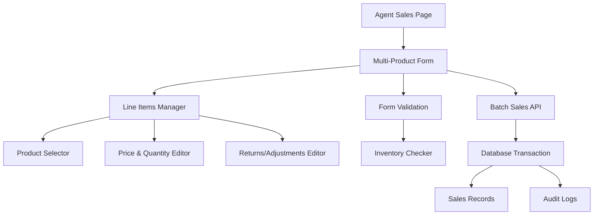
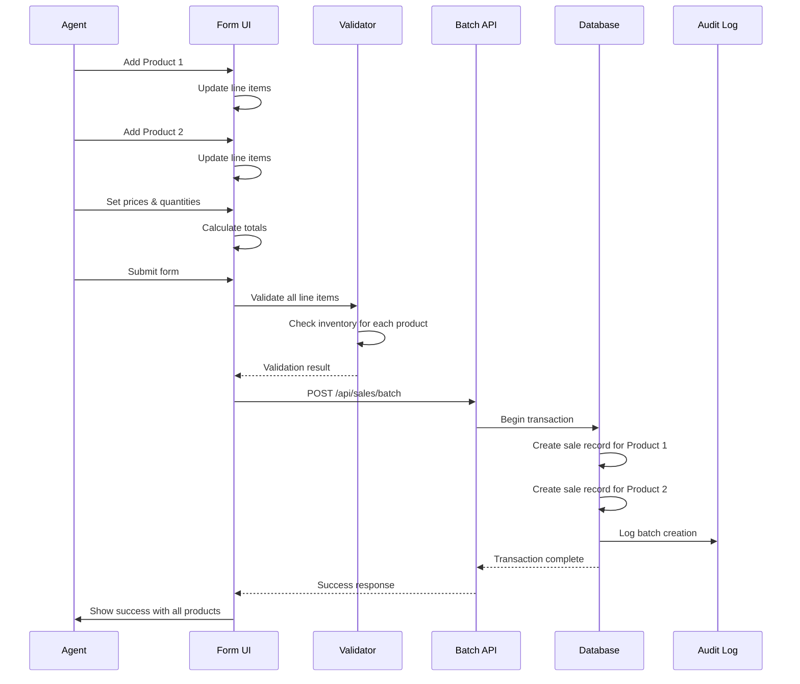
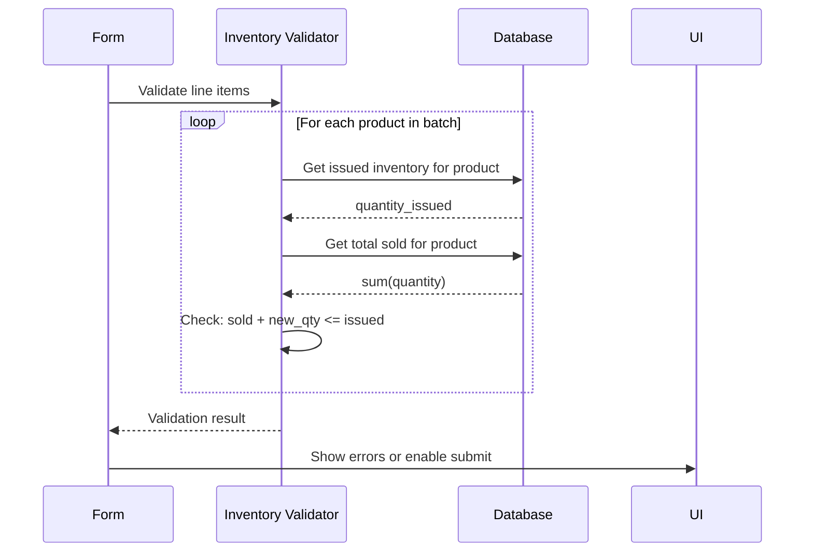

# Design Document: Multi-Product Sales Feature

## Overview

This feature extends the agent sales page to support creating sales transactions with multiple products in a single operation. Currently, agents can only sell one product per transaction. The multi-product sales feature allows agents to:

1. Select and add multiple products to a single sale transaction
2. Set individual price, quantity, and returns/adjustments for each product
3. Create a complete batch sale with all products at once
4. View a line-item summary before submission
5. Validate inventory availability across all products

This design maintains backward compatibility with the existing single-product sales flow while introducing a new batch creation capability.

## Architecture



## Sequence Diagrams

### Multi-Product Sale Creation Flow



### Inventory Validation Flow



## Components and Interfaces

### Component 1: MultiProductSaleForm

**Purpose**: Main form component that manages the multi-product sale creation workflow. Replaces or extends the existing NewSaleForm component.

**Interface**:
```typescript
interface MultiProductSaleFormProps {
  onSuccess?: () => void
}

interface LineItem {
  id: string // Unique identifier for this line item
  productId: string
  productName: string
  unitPrice: number
  quantity: number
  totalAmount: number // quantity * unitPrice
  returnsAmount: number
  adjustmentsAmount: number
}

interface MultiProductSaleFormState {
  lineItems: LineItem[]
  saleDate: string
  customerName: string
  customerPhone: string
  location: string
  route: string
  bankDetails: string
  expensesTotal: number
  tokensDeducted: number
  notes: string
  isSubmitting: boolean
  submitError: string | null
}
```

**Responsibilities**:
- Manage line items state (add, remove, update)
- Validate individual line items and batch
- Calculate totals and summaries
- Handle form submission to batch API
- Display success/error states
- Provide UI for adding/editing products

### Component 2: LineItemsTable

**Purpose**: Display and manage the list of products in the sale transaction.

**Interface**:
```typescript
interface LineItemsTableProps {
  items: LineItem[]
  onAddItem: () => void
  onRemoveItem: (id: string) => void
  onUpdateItem: (id: string, updates: Partial<LineItem>) => void
  isLoading?: boolean
}
```

**Responsibilities**:
- Display line items in table format
- Show product name, quantity, unit price, total
- Provide inline editing for quantity and returns
- Show remove button for each item
- Display batch totals (quantity, amount, returns)
- Handle add product button

### Component 3: ProductSelector

**Purpose**: Modal or dropdown for selecting products to add to the sale.

**Interface**:
```typescript
interface ProductSelectorProps {
  onSelect: (product: Product) => void
  excludeProductIds?: string[] // Products already in line items
  isOpen: boolean
  onClose: () => void
}
```

**Responsibilities**:
- Display available products
- Show product name, unit price, available inventory
- Filter out already-selected products
- Handle product selection
- Close modal after selection

### Component 4: LineItemEditor

**Purpose**: Inline editor for modifying line item details.

**Interface**:
```typescript
interface LineItemEditorProps {
  item: LineItem
  onSave: (updates: Partial<LineItem>) => void
  onCancel: () => void
}
```

**Responsibilities**:
- Edit quantity, returns amount, adjustments
- Validate input values
- Calculate totals in real-time
- Handle save/cancel actions

## Data Models

### LineItem Model

```typescript
interface LineItem {
  id: string // UUID or unique identifier
  productId: string
  productName: string
  unitPrice: number // From product master
  quantity: number // Units being sold
  totalAmount: number // quantity * unitPrice (calculated)
  returnsAmount: number // Returns/adjustments for this product
  adjustmentsAmount: number // Additional adjustments
}

// Validation Rules:
// - productId must be non-empty string
// - quantity must be positive integer
// - unitPrice must be non-negative number
// - totalAmount must equal quantity * unitPrice
// - returnsAmount must be non-negative
// - adjustmentsAmount must be non-negative
// - No duplicate productIds in same batch
```

### BatchSaleRequest Model

```typescript
interface BatchSaleRequest {
  lineItems: LineItem[]
  saleDate: string // YYYY-MM-DD format
  customerName?: string
  customerPhone?: string
  location?: string
  route?: string
  bankDetails?: string
  expensesTotal: number
  tokensDeducted: number
  notes?: string
}

// Validation Rules:
// - lineItems must have at least 1 item
// - lineItems must have at most 50 items
// - saleDate must be valid date string
// - All line items must pass individual validation
// - Total inventory must be available for all products
// - expensesTotal must be non-negative
// - tokensDeducted must be non-negative
```

### BatchSaleResponse Model

```typescript
interface BatchSaleResponse {
  batchId: string // Unique identifier for this batch
  saleRecords: Sale[] // Array of created sale records
  totalAmount: number // Sum of all line item totals
  totalQuantity: number // Sum of all quantities
  totalReturns: number // Sum of all returns
  createdAt: string // ISO timestamp
}

// Each Sale record in saleRecords follows existing schema:
// {
//   id: string
//   agent_id: string
//   product_id: string
//   quantity: number
//   amount: number
//   date: string
//   customer_name?: string
//   customer_phone?: string
//   location?: string
//   route?: string
//   bank_details?: string
//   expenses_total: number
//   tokens_deducted: number
//   returns_amount: number
//   notes?: string
//   created_at: string
// }
```

## Error Handling

### Error Scenario 1: Insufficient Inventory

**Condition**: Total quantity for a product exceeds available issued inventory
**Response**: Display error message showing which products have insufficient inventory
**Recovery**: User can reduce quantities or remove products from the batch

```
Error: "Insufficient inventory for the following products:
- Product A: Need 50 units, only 30 available
- Product B: Need 100 units, only 75 available"
```

### Error Scenario 2: Invalid Line Item

**Condition**: A line item has invalid data (negative quantity, mismatched total, etc.)
**Response**: Highlight the problematic line item with specific error message
**Recovery**: User corrects the line item data

```
Error on line item 2: "Quantity must be greater than 0"
```

### Error Scenario 3: Duplicate Product

**Condition**: User tries to add the same product twice to the batch
**Response**: Show warning and prevent adding duplicate
**Recovery**: User can increase quantity of existing line item instead

```
Warning: "Product 'Wireless Headphones' is already in this sale.
Increase the quantity instead of adding it again."
```

### Error Scenario 4: Batch Size Exceeded

**Condition**: User tries to add more than 50 products to a single batch
**Response**: Prevent adding additional products, show message
**Recovery**: User creates a separate batch for additional products

```
Error: "Maximum 50 products per batch. Please create a separate sale for additional products."
```

### Error Scenario 5: API Failure During Batch Creation

**Condition**: Server error occurs while creating batch sale
**Response**: Show error message with retry option
**Recovery**: User can retry submission or save draft for later

```
Error: "Failed to create batch sale. Please try again or contact support."
[Retry] [Save Draft] [Cancel]
```

## Testing Strategy

### Unit Testing Approach

**Test Coverage Areas**:
1. **LineItem Validation**
   - Valid line item creation
   - Invalid quantity (zero, negative, non-integer)
   - Invalid prices (negative)
   - Duplicate product detection
   - Total amount calculation accuracy

2. **Batch Validation**
   - Minimum 1 item requirement
   - Maximum 50 items limit
   - Date format validation
   - All line items must be valid
   - Inventory availability check

3. **Form State Management**
   - Add line item
   - Remove line item
   - Update line item
   - Clear all items
   - Reset form

4. **Calculations**
   - Line item total (quantity × unitPrice)
   - Batch total amount
   - Batch total quantity
   - Batch total returns

### Property-Based Testing Approach

**Property Test Library**: fast-check

**Properties to Test**:

1. **Idempotent Calculations**
   - Property: Calculating totals multiple times produces same result
   - Generator: Random line items with valid quantities and prices
   - Assertion: `total(items) === total(total(items))`

2. **Inventory Conservation**
   - Property: Sum of sold quantities never exceeds issued inventory
   - Generator: Random quantities up to issued amount
   - Assertion: `sum(quantities) <= issued_inventory`

3. **Amount Accuracy**
   - Property: Total amount always equals sum of line item amounts
   - Generator: Random line items with various quantities and prices
   - Assertion: `batchTotal === sum(lineItem.totalAmount for each lineItem)`

4. **Batch Constraints**
   - Property: Batch always has between 1 and 50 items
   - Generator: Random number of line items
   - Assertion: `1 <= lineItems.length <= 50`

5. **Price Consistency**
   - Property: Unit price from product never changes within batch
   - Generator: Multiple line items of same product
   - Assertion: `all(item.unitPrice === product.unit_price)`

### Integration Testing Approach

**Test Scenarios**:

1. **Happy Path: Complete Multi-Product Sale**
   - Add 3 products with different quantities
   - Set customer details
   - Submit batch
   - Verify all 3 sales records created
   - Verify audit log entry

2. **Inventory Validation**
   - Agent has 50 units of Product A issued
   - Try to sell 60 units
   - Verify error message
   - Reduce to 50 units
   - Verify submission succeeds

3. **Partial Failure Recovery**
   - Add 5 products
   - Remove 2 products
   - Modify quantities
   - Submit successfully

4. **Concurrent Submissions**
   - Two agents submit batches simultaneously
   - Verify both succeed if inventory available
   - Verify one fails if inventory insufficient

5. **Backward Compatibility**
   - Single-product sales still work via existing endpoint
   - Existing sales records unaffected
   - Agent dashboard shows all sales (single and batch)

## Performance Considerations

### Database Performance

**Batch Insert Optimization**:
- Use single transaction for all line items
- Minimize round-trips to database
- Index on (agent_id, product_id) for inventory checks
- Batch inventory validation queries

**Query Optimization**:
- Pre-fetch product details before form submission
- Cache product list in component state
- Lazy-load inventory availability on demand

### Form Performance

**State Management**:
- Use React.useMemo for expensive calculations
- Debounce inventory validation checks
- Virtualize line items table if > 20 items
- Lazy-load product selector modal

**Network Performance**:
- Batch API call reduces round-trips vs. individual calls
- Compress request payload
- Implement request timeout (30 seconds)
- Show loading state during submission

### Scalability

**Batch Size Limits**:
- Maximum 50 products per batch (prevents large payloads)
- Maximum 500 line items per day per agent (rate limiting)
- Implement pagination for product selector if > 1000 products

## Security Considerations

### Authorization

- Only authenticated agents can create sales
- Agents can only create sales for their own agent_id
- Verify agent_id matches authenticated user before processing

### Input Validation

- Validate all line item data on server
- Validate batch size (1-50 items)
- Validate quantities are positive integers
- Validate prices are non-negative numbers
- Validate dates are in valid format
- Sanitize text fields (customer name, notes)

### Data Integrity

- Use database transaction to ensure all-or-nothing batch creation
- Verify inventory availability at time of submission (not before)
- Prevent race conditions with row-level locking
- Log all batch operations for audit trail

### Audit Trail

- Create audit log entry for each batch creation
- Include all line items in audit log details
- Track which agent created the batch
- Record timestamp and IP address

## Dependencies

### Frontend Dependencies

- `react-hook-form`: Form state management
- `zod`: Schema validation
- `@hookform/resolvers/zod`: Form validation integration
- `lucide-react`: Icons
- Existing UI components (Button, Input, Select, Card, etc.)

### Backend Dependencies

- `zod`: Request validation
- `@supabase/supabase-js`: Database client
- Existing middleware (withAuth, getUserProfile)
- Existing services (createAuditLog)

### Database

- Existing `sales` table (no schema changes needed)
- Existing `inventory` table (for availability checks)
- Existing `products` table (for product details)
- Existing `agents` table (for agent_id lookup)

## API Specification

### New Endpoint: POST /api/sales/batch

**Purpose**: Create multiple sales records in a single transaction

**Request**:
```typescript
POST /api/sales/batch
Content-Type: application/json
Authorization: Bearer {token}

{
  "lineItems": [
    {
      "productId": "123",
      "quantity": 10,
      "returnsAmount": 0,
      "adjustmentsAmount": 0
    },
    {
      "productId": "456",
      "quantity": 5,
      "returnsAmount": 50,
      "adjustmentsAmount": 0
    }
  ],
  "saleDate": "2024-01-15",
  "customerName": "John Doe",
  "customerPhone": "+1-555-0123",
  "location": "Downtown Store",
  "route": "Route A",
  "bankDetails": "Account 12345",
  "expensesTotal": 100,
  "tokensDeducted": 50,
  "notes": "Bulk order"
}
```

**Response (Success - 201)**:
```typescript
{
  "batchId": "batch_abc123",
  "saleRecords": [
    {
      "id": "sale_001",
      "agent_id": "agent_123",
      "product_id": "123",
      "quantity": 10,
      "amount": 500,
      "date": "2024-01-15",
      "customer_name": "John Doe",
      "customer_phone": "+1-555-0123",
      "location": "Downtown Store",
      "route": "Route A",
      "bank_details": "Account 12345",
      "expenses_total": 100,
      "tokens_deducted": 50,
      "returns_amount": 0,
      "notes": "Bulk order",
      "created_at": "2024-01-15T10:30:00Z"
    },
    {
      "id": "sale_002",
      "agent_id": "agent_123",
      "product_id": "456",
      "quantity": 5,
      "amount": 250,
      "date": "2024-01-15",
      "customer_name": "John Doe",
      "customer_phone": "+1-555-0123",
      "location": "Downtown Store",
      "route": "Route A",
      "bank_details": "Account 12345",
      "expenses_total": 100,
      "tokens_deducted": 50,
      "returns_amount": 50,
      "notes": "Bulk order",
      "created_at": "2024-01-15T10:30:00Z"
    }
  ],
  "totalAmount": 750,
  "totalQuantity": 15,
  "totalReturns": 50,
  "createdAt": "2024-01-15T10:30:00Z"
}
```

**Response (Validation Error - 400)**:
```typescript
{
  "success": false,
  "error": "Insufficient inventory for product 123: need 10, have 5",
  "data": null
}
```

**Response (Auth Error - 401/403)**:
```typescript
{
  "success": false,
  "error": "Unauthorized",
  "data": null
}
```

### Existing Endpoint: POST /api/sales (Single Product)

**Status**: Maintained for backward compatibility
**Changes**: None - continues to work as before
**Migration**: Agents can use either endpoint based on their needs

## Implementation Notes

### Database Transaction Handling

The batch creation must use a database transaction to ensure atomicity:
- All line items succeed together or all fail together
- No partial batches in database
- Rollback on any validation failure

### Inventory Checking Strategy

Inventory validation happens at two points:
1. **Client-side** (optimistic): Show warnings before submission
2. **Server-side** (authoritative): Final validation before creating sales

This prevents race conditions where inventory changes between client validation and server submission.

### Backward Compatibility

- Existing single-product sales endpoint remains unchanged
- Existing NewSaleForm component can coexist with new MultiProductSaleForm
- Database schema requires no changes
- Existing sales records unaffected

### Migration Path

Phase 1: Deploy batch API endpoint
Phase 2: Deploy new MultiProductSaleForm component
Phase 3: Update agent dashboard to show both options
Phase 4: (Optional) Deprecate single-product form in future version

## Correctness Properties

### Universal Quantification Statements

1. **Inventory Constraint**: For all line items in a batch, the sum of quantities sold for a product must not exceed the issued inventory for that product.
   ```
   ∀ batch ∈ BatchSales, ∀ product ∈ batch.lineItems:
     sum(quantity for all sales of product by agent) ≤ issued_inventory(agent, product)
   ```

2. **Amount Accuracy**: For all line items, the total amount must equal quantity multiplied by unit price.
   ```
   ∀ lineItem ∈ batch.lineItems:
     lineItem.totalAmount = lineItem.quantity × lineItem.unitPrice
   ```

3. **Batch Integrity**: For all batches, either all line items are created or none are created (atomicity).
   ```
   ∀ batch ∈ BatchSales:
     (∀ lineItem ∈ batch: created(lineItem)) ∨ (∀ lineItem ∈ batch: ¬created(lineItem))
   ```

4. **Audit Trail**: For all batches created, an audit log entry must exist.
   ```
   ∀ batch ∈ BatchSales:
     ∃ auditLog ∈ AuditLogs: auditLog.batchId = batch.id ∧ auditLog.action = "sales.batch.create"
   ```

5. **Batch Size Constraint**: For all batches, the number of line items must be between 1 and 50.
   ```
   ∀ batch ∈ BatchSales:
     1 ≤ |batch.lineItems| ≤ 50
   ```

6. **Product Uniqueness**: For all batches, no product ID appears more than once in line items.
   ```
   ∀ batch ∈ BatchSales:
     ∀ productId: count(lineItem.productId = productId) ≤ 1
   ```

7. **Authorization**: For all batches, the agent_id must match the authenticated user's agent.
   ```
   ∀ batch ∈ BatchSales:
     batch.agent_id = authenticatedUser.agent_id
   ```

8. **Data Consistency**: For all batches, the sum of line item amounts must equal the batch total amount.
   ```
   ∀ batch ∈ BatchSales:
     batch.totalAmount = sum(lineItem.totalAmount for all lineItems)
   ```
