# Review Document System

A comprehensive sales and inventory management system built with Next.js and Supabase.

## Quick Start

📖 **New to this project?** Start with [⚡_START_HERE.md](./docs/⚡_START_HERE.md)

## Project Structure

```
├── app/              # Next.js app directory (pages & routes)
├── components/       # React components
├── lib/             # Utility functions and shared code
├── services/        # Business logic and API services
├── hooks/           # Custom React hooks
├── docs/            # 📚 All project documentation
├── migrations/      # 🗄️ Database migration files
├── archive/         # 🗃️ Historical files and old artifacts
└── .kiro/           # Kiro AI specifications
```

## Documentation

All project documentation is organized in the [`/docs`](./docs) folder:

- **Getting Started**: [⚡_START_HERE.md](./docs/⚡_START_HERE.md)
- **Project Overview**: [📋_PROJECT_SUMMARY.md](./docs/📋_PROJECT_SUMMARY.md)
- **Authentication**: [AUTH_SETUP_GUIDE.md](./docs/AUTH_SETUP_GUIDE.md)
- **Analytics**: [ANALYTICS_COMPLETE_GUIDE.md](./docs/ANALYTICS_COMPLETE_GUIDE.md)

[View all documentation →](./docs/README.md)

## Database Migrations

All SQL migration files are in the [`/migrations`](./migrations) folder with sequential numbering.

[View migration guide →](./migrations/README.md)

---

# Application Pages Guide

This system provides three main user interfaces: **Admin Portal**, **Agent Portal**, and **Manager Portal**. Each portal is designed for specific user roles with tailored functionality.

## 🔐 Authentication Pages

### Login Page (`/login`)
- **Purpose**: User authentication and secure access to the system
- **Features**: Email/password login, role-based redirection
- **Access**: Public
- **[Screenshot placeholder]**

### Signup Page (`/signup`)
- **Purpose**: New user registration
- **Features**: Account creation with role selection
- **Access**: Public
- **[Screenshot placeholder]**

### Forgot Password (`/forgot-password`)
- **Purpose**: Password recovery initiation
- **Features**: Email-based password reset
- **Access**: Public
- **[Screenshot placeholder]**

### Reset Password (`/reset-password`)
- **Purpose**: Complete password reset process
- **Features**: Secure password update with token validation
- **Access**: Public (via email link)
- **[Screenshot placeholder]**

### Pending Approval (`/pending-approval`)
- **Purpose**: Status page for users awaiting account approval
- **Features**: Approval status display, logout option
- **Access**: Authenticated (pending users)
- **[Screenshot placeholder]**

### Unauthorized (`/unauthorized`)
- **Purpose**: Access denied page
- **Features**: Error message, navigation options
- **Access**: Public
- **[Screenshot placeholder]**

---

## 👨‍💼 Admin Portal (`/admin`)

The admin portal provides comprehensive management capabilities for administrators to oversee the entire system.

### Admin Dashboard (`/admin/dashboard`)
- **Purpose**: Central overview of all system metrics and performance
- **Features**:
  - KPI Cards: Total Sales, Active Agents, Total Expenses, Pending Approvals, Inventory Units, Net Revenue
  - Sales Trend Chart: Visual representation of sales over time
  - Expense Breakdown Chart: Category-wise expense analysis
  - Revenue Chart: Overall revenue tracking
  - Recent Sales Table: Latest transactions overview
  - Pending Approvals Table: Users awaiting approval
- **Access**: Admin only
- **[Screenshot placeholder]**
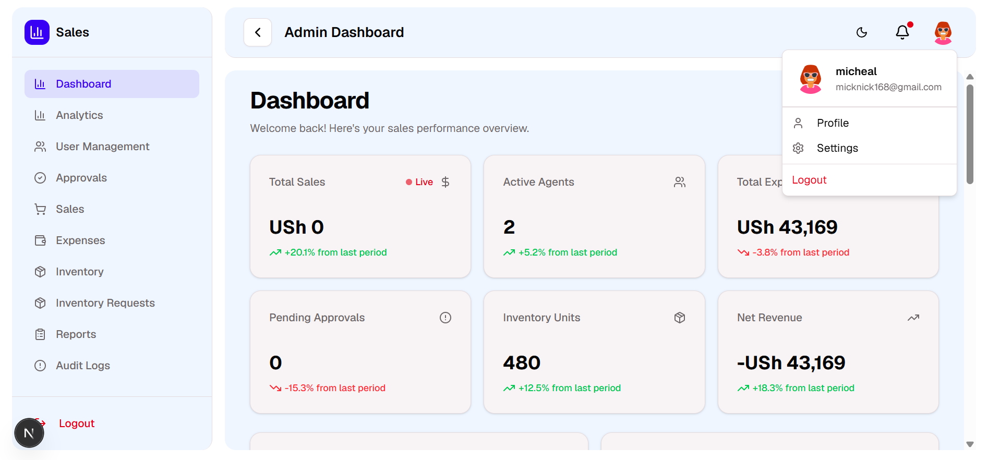

### User Management (`/admin/users`)
- **Purpose**: Manage all user accounts in the system
- **Features**:
  - User statistics cards (Total, Pending, Active, Rejected)
  - Tabbed interface for filtering by status
  - User data table with approve/reject/suspend actions
  - Role assignment capabilities
  - Bulk user operations
- **Access**: Admin only
- **[Screenshot placeholder]**
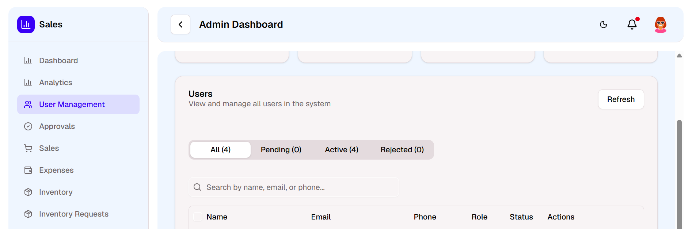
### Sales Management (`/admin/sales`)
- **Purpose**: View and manage all sales transactions across all agents
- **Features**:
  - Sales statistics (Total Sales, Expenses, Returns, Net Revenue)
  - Advanced filtering by date range, route, and search
  - Detailed sales table with agent information
  - CSV export functionality
  - Transaction details including tokens and returns
- **Access**: Admin only
- **[Screenshot placeholder]**
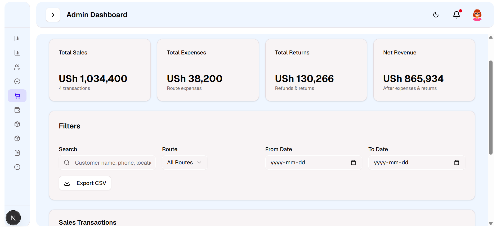

### Expenses Management (`/admin/expenses`)
- **Purpose**: Track and manage all expenses in the system
- **Features**:
  - Expense categorization and tracking
  - Agent expense monitoring
  - Date-based filtering
  - Expense approval workflow
- **Access**: Admin only
- **[Screenshot placeholder]**
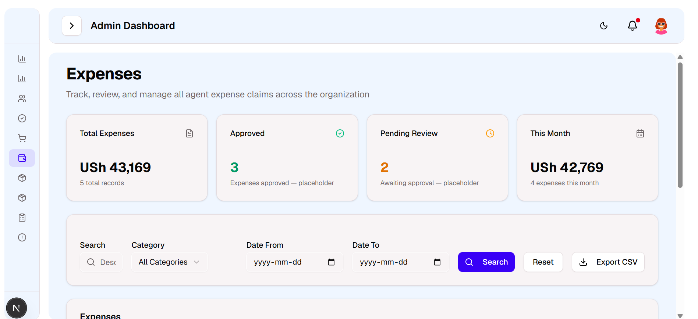
### Inventory Management (`/admin/inventory`)
- **Purpose**: Oversee all inventory across the system
- **Features**:
  - Product inventory levels
  - Stock allocation by agent
  - Low stock alerts
  - Inventory movement tracking
- **Access**: Admin only
- **[Screenshot placeholder]**
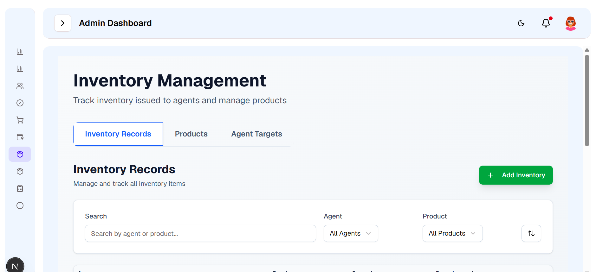
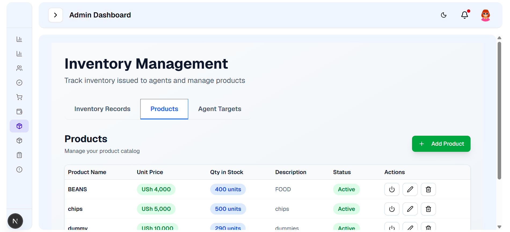
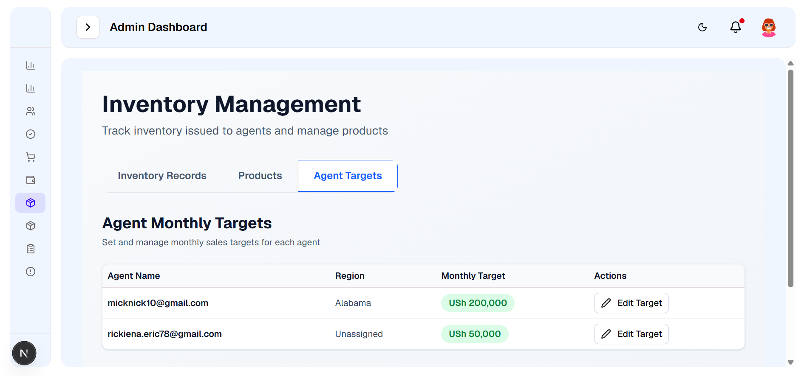
### Inventory Requests (`/admin/inventory-requests`)
- **Purpose**: Manage inventory requests from agents
- **Features**:
  - Request approval workflow
  - Request history and status tracking
  - Quantity allocation management
  - Request reason documentation
- **Access**: Admin only
- **[Screenshot placeholder]**
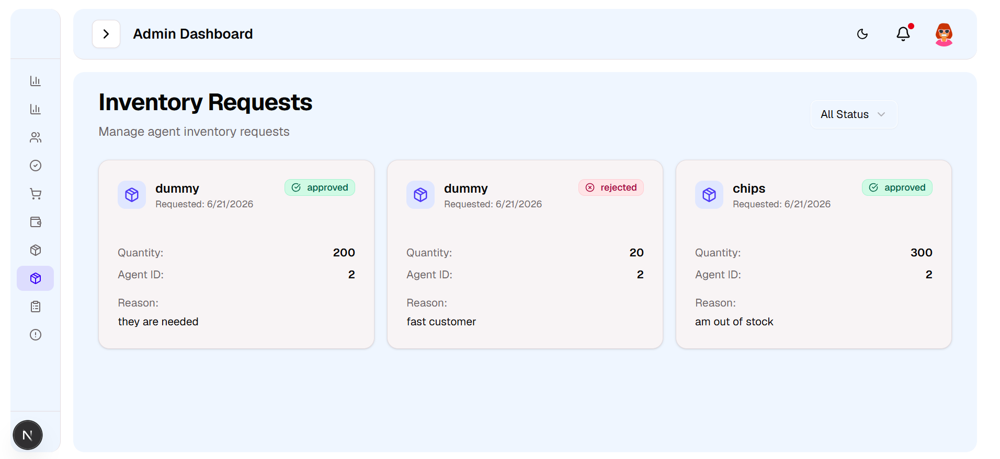
### Analytics (`/admin/analytics`)
- **Purpose**: Advanced analytics and reporting
- **Features**:
  - Performance metrics and trends
  - Agent performance comparison
  - Sales forecasting
  - Custom report generation
- **Access**: Admin only
- **[Screenshot placeholder]**
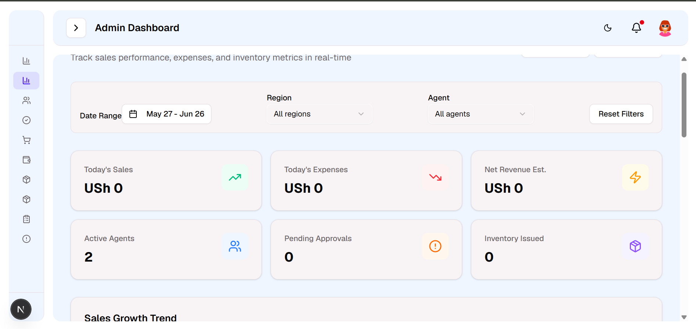
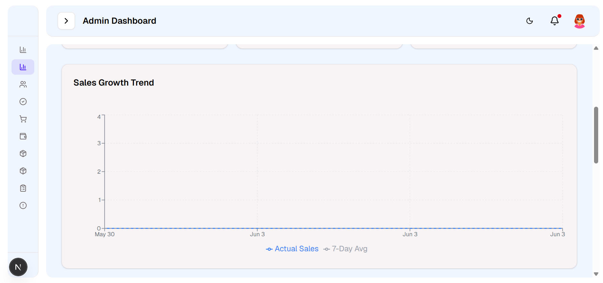
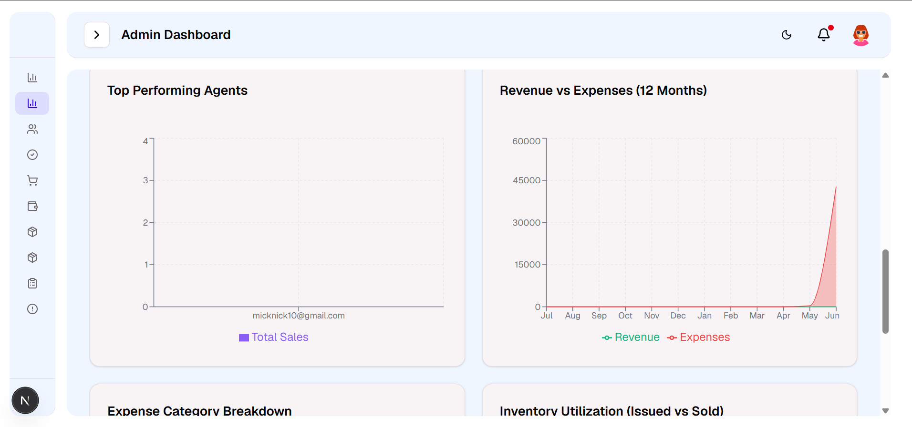
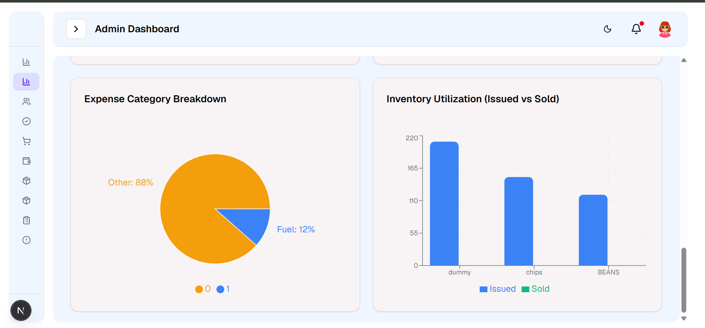
### Approvals (`/admin/approvals`)
- **Purpose**: Centralized approval management
- **Features**:
  - User registration approvals
  - Expense approvals
  - Inventory request approvals
  - Bulk approval actions
- **Access**: Admin only
- **[Screenshot placeholder]**
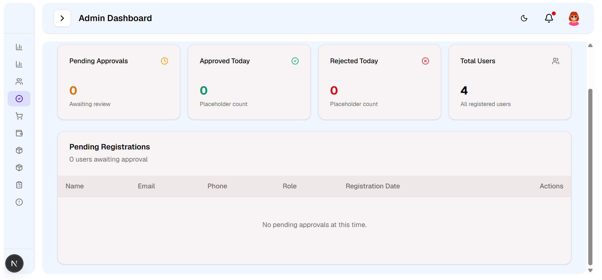
### Reports (`/admin/reports`)
- **Purpose**: Generate and view system reports
- **Features**:
  - Sales reports
  - Expense reports
  - Inventory reports
  - Agent performance reports
  - Export capabilities
- **Access**: Admin only
- **[Screenshot placeholder]**
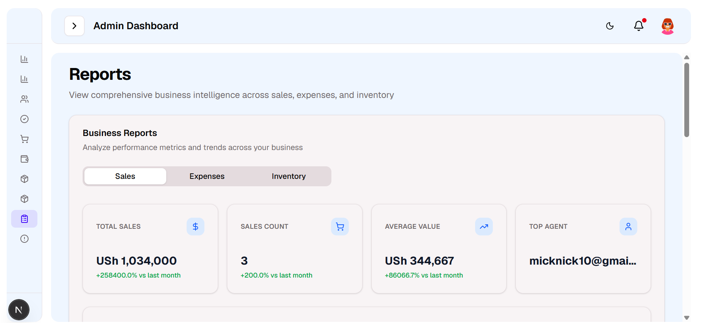
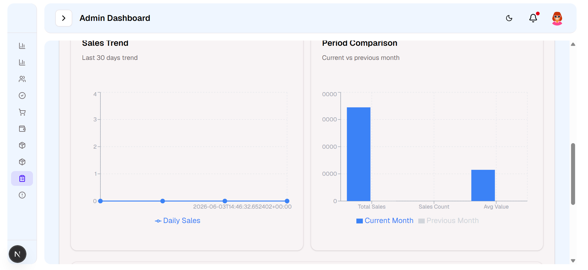
### Audit Logs (`/admin/audit-logs`)
- **Purpose**: Track all system activities and changes
- **Features**:
  - Comprehensive activity logging
  - User action tracking
  - System change history
  - Security audit trail
- **Access**: Admin only
- **[Screenshot placeholder]**
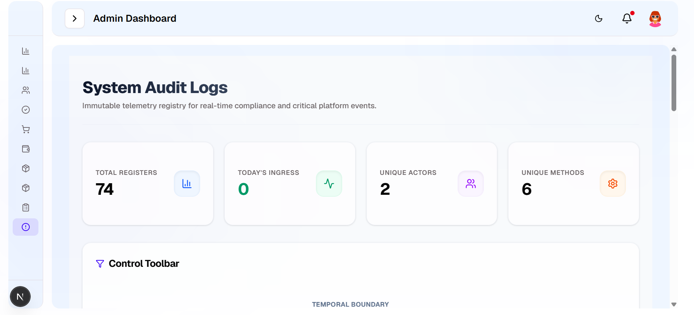
### Admin Profile (`/admin/profile`)
- **Purpose**: Manage admin account settings
- **Features**:
  - Profile information update
  - Password change
  - Account preferences
- **Access**: Admin only
- **[Screenshot placeholder]**

### Admin Settings (`/admin/settings`)
- **Purpose**: System-wide configuration
- **Features**:
  - System settings management
  - User role configurations
  - Notification preferences
  - System parameters
- **Access**: Admin only
- **[Screenshot placeholder]**

---

## 🛒 Agent Portal (`/agent`)

The agent portal is designed for sales agents to manage their daily operations, sales, and inventory.

### Agent Dashboard (`/agent/dashboard`)
- **Purpose**: Personal performance overview and quick actions
- **Features**:
  - Circular KPI cards showing Gross Sales, Net Sales, Monthly Target progress, and Units Assigned
  - Date navigator with Daily/Weekly/Monthly view modes
  - Sales performance chart
  - Recent sales list
  - Recent expenses list
  - Inventory overview
  - Monthly target progress with visual progress bar
  - Quick action buttons for common tasks
- **Access**: Agent only
- **[Screenshot placeholder]**
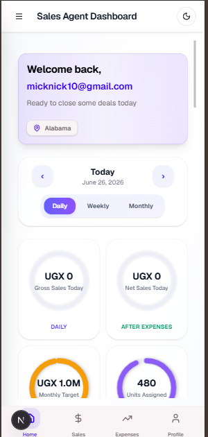
### Agent Sales (`/agent/sales`)
- **Purpose**: Manage personal sales transactions
- **Features**:
  - KPI cards: Total Revenue, Transactions, Average Sale
  - Create new sale functionality
  - Sales table with expandable details
  - Search and filter by customer, payment method, date
  - Pagination for large datasets
  - Detailed item-level view in expanded rows
  - Payment method badges (Cash, Card, Mobile)
- **Access**: Agent only
- **[Screenshot placeholder]**
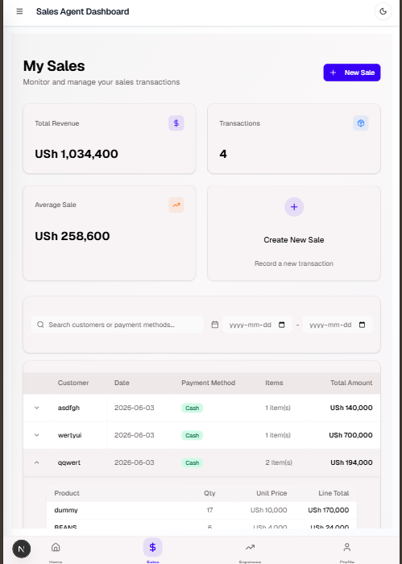
### Agent Expenses (`/agent/expenses`)
- **Purpose**: Track and manage personal expenses
- **Features**:
  - Expense logging and categorization
  - Date-based expense tracking
  - Expense approval status
  - Receipt attachment support
  - Expense history
- **Access**: Agent only
- **[Screenshot placeholder]**
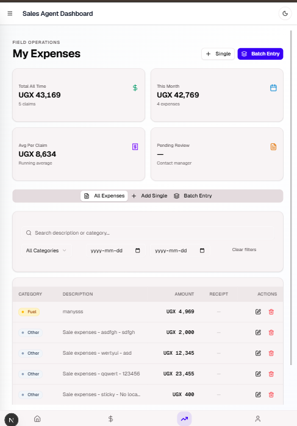
### Agent Inventory (`/agent/inventory`)
- **Purpose**: View assigned inventory and request more stock
- **Features**:
  - Inventory cards showing product name, quantity, and status
  - Stock level indicators (In Stock, Low Stock, Out of Stock)
  - Visual progress bars for stock levels
  - Low stock alerts
  - Inventory request form
  - Request history with status tracking
  - Quick request buttons for low stock items
- **Access**: Agent only
- **[Screenshot placeholder]**
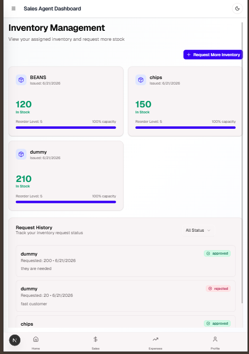
### Agent Profile (`/agent/profile`)
- **Purpose**: Manage personal account settings
- **Features**:
  - Profile information update
  - Contact details management
  - Password change
  - Region assignment view
- **Access**: Agent only
- **[Screenshot placeholder]**
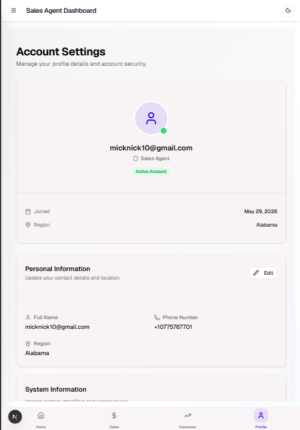
---

## 👔 Manager Portal (`/manager`)

### Manager Dashboard (`/manager/dashboard`)
- **Purpose**: Regional oversight and team management
- **Features**:
  - Team performance overview
  - Regional sales metrics
  - Agent performance comparison
  - Regional inventory status
- **Access**: Manager only
- **[Screenshot placeholder]**

---

## 🎨 UI/UX Features

### Design System
- **Framework**: Tailwind CSS for styling
- **Components**: Radix UI primitives
- **Icons**: Lucide React
- **Charts**: Recharts
- **Theme**: Dark/Light mode support

### Responsive Design
- Mobile-first approach
- Adaptive layouts for tablets and desktops
- Touch-friendly interfaces for mobile agents

### Accessibility
- Keyboard navigation support
- Screen reader compatible
- High contrast mode support
- Clear visual hierarchy

---

## 🔒 Security Features

- Role-based access control (RBAC)
- Secure authentication with Supabase Auth
- API route protection
- Data validation and sanitization
- Audit logging for sensitive actions

---

## Tech Stack

- **Framework**: Next.js 16+ (App Router)
- **Database**: Supabase (PostgreSQL)
- **Authentication**: Supabase Auth
- **UI**: React + Tailwind CSS
- **TypeScript**: Full type safety
- **Charts**: Recharts
- **Forms**: React Hook Form + Zod validation
- **State Management**: React hooks
- **HTTP Client**: Native fetch with service layer

---

## Development

```bash
# Install dependencies
npm install

# Run development server
npm run dev

# Build for production
npm run build

# Run tests
npm run test

# Run linting
npm run lint
```

---

## License

[Add your license here]
